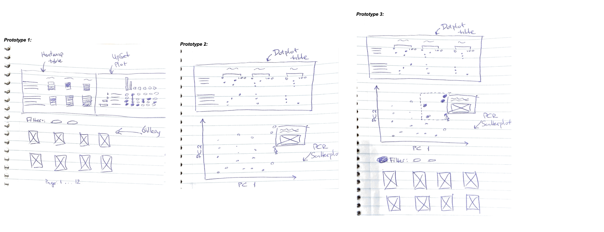
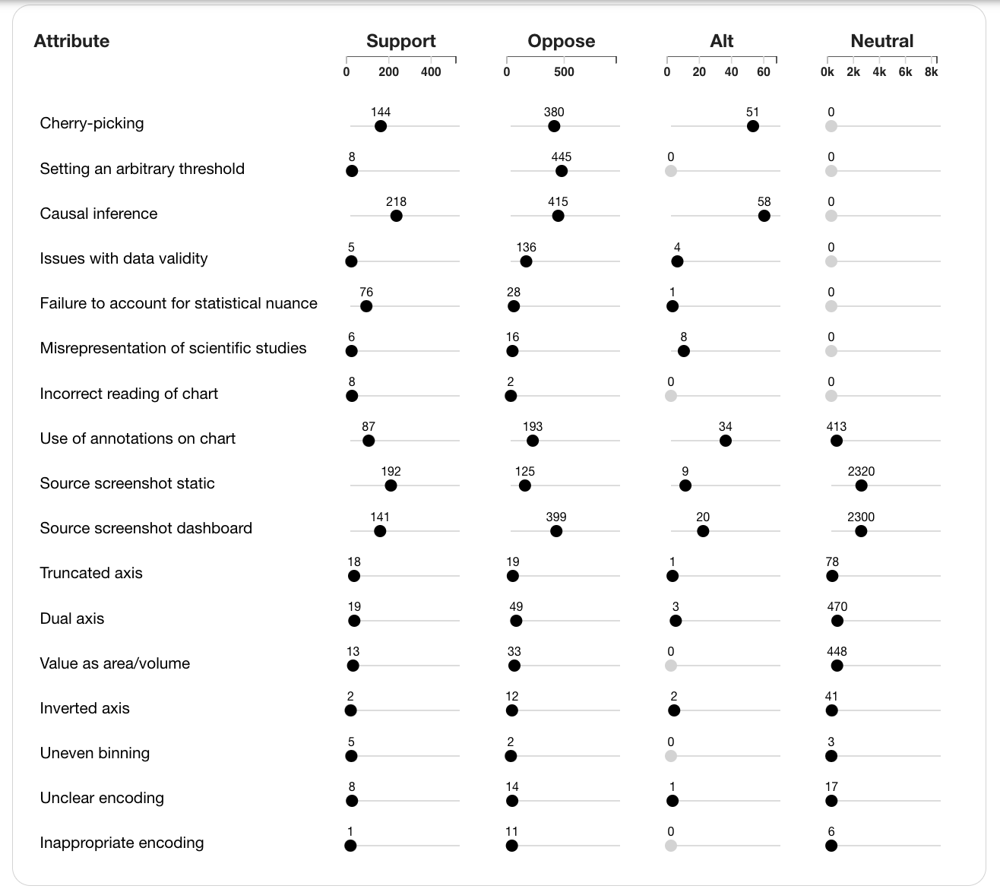

# Overview and Motivation

The motivation for this project stems from an ongoing research project. One of the authors manually labeled a set of nearly 10,000 tweets containing data visualizations to describe the ways visualizations can mislead the audience. This class project serves to augment the research project by providing a platform to both get an overview of high-level patterns in the data and at the same time to explore individual data points in detail.

In this project, we hope to create a visualization tool with multiple coordinated views to show twitter data with some manually coded attributes. The tool should both provide a high-level overview and also allow the user to dive deeper into individual tweets. We hope that the tool will also help uncover interesting patterns in the data and inspire future analysis.

# Related Work

Main inspiration comes from the figures in the [paper submission](10.31219/osf.io/ky6th) related to the misleading visualizations project: Figures 5 and 6 provide the overview statistics and their interactive versions are to be used as the main views in our project. Figure 6 in the paper submission and one of the views in the tool are inspired by [UpSet plot](https://upset.app) created by Lex et al. [^1]

[^1]: A. Lex, N. Gehlenborg, H. Strobelt, R. Vuillemot and H. Pfister, "UpSet: Visualization of Intersecting Sets," in IEEE Transactions on Visualization and Computer Graphics, vol. 20, no. 12, pp. 1983-1992, 31 Dec. 2014, doi: 10.1109/TVCG.2014.2346248.

# Questions

We hope the tool helps answer the following questions:
- What are the example tweets for a given attribute?
- What are the example tweets for a given set of attributes?
- What are the common sets of attributes?
- Given an attribute, what are the commonly co-occurring other attributes?

# Data

Our data comes from Max’s recent paper submission to CHI. The data is tabular and contains information about tweets, images contained within the tweets, and a by-hand encoding of engineered variables that describe: the source of the visualizations, the polarization of the tweet text, visualization design violations, and any reasoning errors that the authors made.

In accordance with Twitter's [Terms of Service](https://developer.twitter.com/en/developer-terms/policy) and [Display Requirements](https://developer.twitter.com/en/developer-terms/display-requirements), we do not serve tweet text and associated images ourselves, but rather query [Twitter API](https://developer.twitter.com/en/docs/twitter-for-websites/oembed-api#item1) to display embedded tweets. This way, in case when a tweet is deleted, made private, or comes from a suspended account, it will not be displayed in the tool. This allows us to make the tool public, not need to maintain our own server infrastructure, and maintain privacy of Twitter users.

# Exploratory Data Analysis

The exploratory data analysis was mainly performed before the project began, during the initial analysis of misleading visualizations for the paper submission. One of the main insights we gained is that violations of common visualization design guidelines---such as truncated axes or encoding of values as areas of volume---does not disproportionally lead to the misinterpretation of charts and does not disproportionally support visual misinformation online. This fact makes it important to contrast the prevalence of design violations and reasoning errors and make such values easily comparable in the tool.

Another important finding and a promising avenue for future research is the fact that many attributes of misleading visualizations have important interactions. For instance, many cherry-picked visualizations come from screenshots of interactive visualization dashboards or data exploration websites, such as [Our World in Data](https://ourworldindata.org/). Because of this, we chose to include an UpSet plot to emphasize sets of commonly co-occurring attributes of misleading charts.

# Design Evolution

Original prototypes describe 3 coordinated views of the data. We proposed a few different options for each view: dotplot or heatmap for the overview table, UpSet plot or a PCA scatterplot for the second view, and an explicit gallery or just a details-on-demand interactivity with the scatterplot. For simplicity, we moved forward with an explicit gallery and an UpSet plot. We also decided to implement a dotplot table.

At the milestone point of our project, our design is still evolving. For the overview table, we would like to be able to show both the absolute count of tweets in any given attribute, as well as the proportion of total tweets by sentiment subset. Because of this, we need to be able to visualize both the absolute value as well as the percentage value.

# Implementation

# Evaluation
