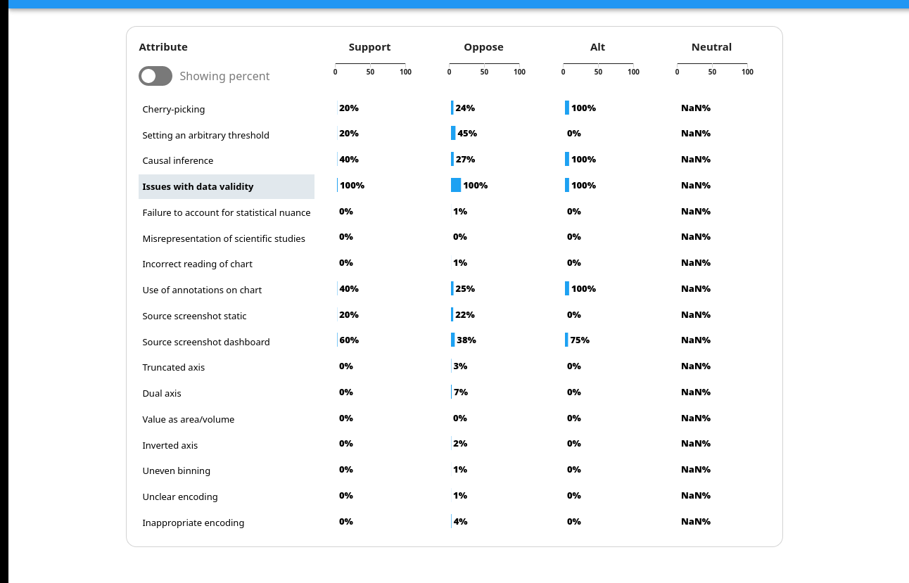
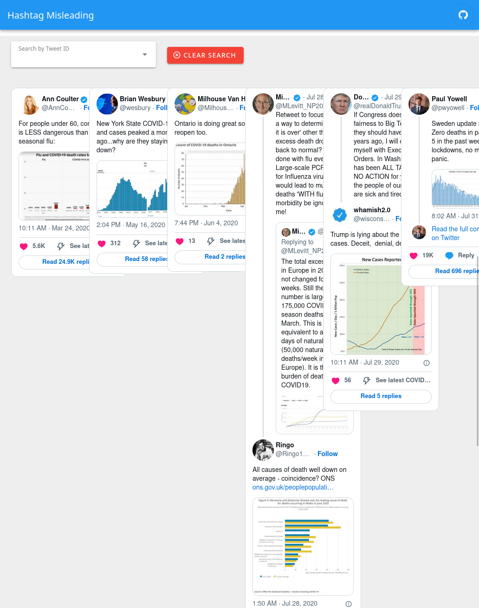
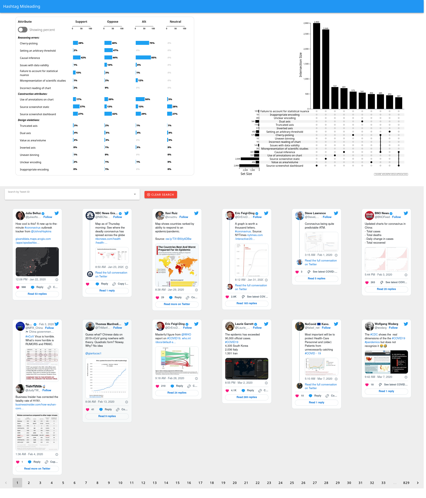
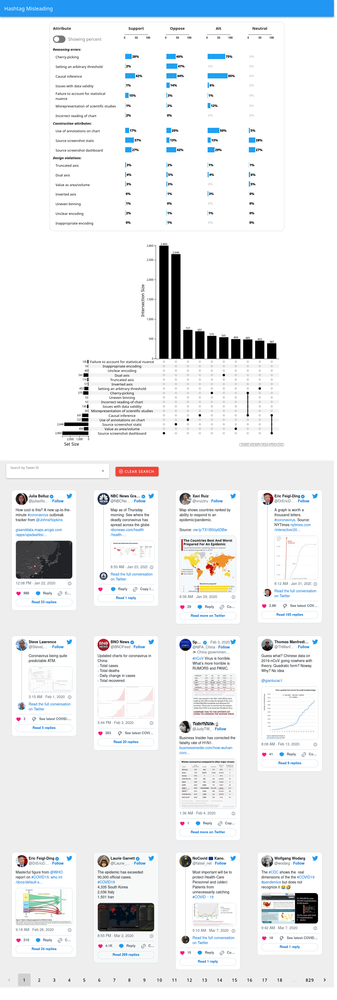
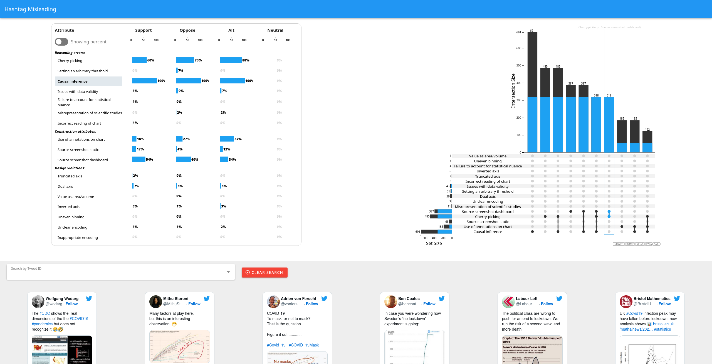

# Overview and Motivation

The motivation for this project stems from an ongoing research project. One of the authors manually labeled a set of nearly 10,000 tweets containing data visualizations to describe the ways visualizations can mislead the audience. This class project serves to augment the research project by providing a platform to both get an overview of high-level patterns in the data and at the same time to explore individual data points in detail.

In this project, we hope to create a visualization tool with multiple coordinated views to show twitter data with some manually coded attributes. The tool should both provide a high-level overview and also allow the user to dive deeper into individual tweets. We hope that the tool will also help uncover interesting patterns in the data and inspire future analysis.

# Related Work

Main inspiration comes from the figures in the [paper submission](10.31219/osf.io/ky6th) related to the misleading visualizations project: Figures 5 and 6 provide the overview statistics and their interactive versions are to be used as the main views in our project. Figure 6 in the paper submission and one of the views in the tool are inspired by [UpSet plot](https://upset.app) created by Lex et al. [^1]

[^1]: A. Lex, N. Gehlenborg, H. Strobelt, R. Vuillemot and H. Pfister, "UpSet: Visualization of Intersecting Sets," in IEEE Transactions on Visualization and Computer Graphics, vol. 20, no. 12, pp. 1983-1992, 31 Dec. 2014, doi: 10.1109/TVCG.2014.2346248.

# Questions

We hope the tool helps answer the following questions:
- What are the example tweets for a given attribute?
- What are the example tweets for a given set of attributes?
- What are the common sets of attributes?
- Given an attribute, what are the commonly co-occurring other attributes?

# Data

Our data comes from Max’s recent paper submission to CHI. The data is tabular and contains information about tweets, images contained within the tweets, and a by-hand encoding of engineered variables that describe: the source of the visualizations, the polarization of the tweet text, visualization design violations, and any reasoning errors that the authors made.

In accordance with Twitter's [Terms of Service](https://developer.twitter.com/en/developer-terms/policy) and [Display Requirements](https://developer.twitter.com/en/developer-terms/display-requirements), we do not serve tweet text and associated images ourselves, but rather query [Twitter API](https://developer.twitter.com/en/docs/twitter-for-websites/oembed-api#item1) to display embedded tweets. This way, in case when a tweet is deleted, made private, or comes from a suspended account, it will not be displayed in the tool. This allows us to make the tool public, not need to maintain our own server infrastructure, and maintain privacy of Twitter users.

# Exploratory Data Analysis

The exploratory data analysis was mainly performed before the project began, during the initial analysis of misleading visualizations for the paper submission. One of the main insights we gained is that violations of common visualization design guidelines---such as truncated axes or encoding of values as areas of volume---does not disproportionally lead to the misinterpretation of charts and does not disproportionally support visual misinformation online. This fact makes it important to contrast the prevalence of design violations and reasoning errors and make such values easily comparable in the tool.

Another important finding and a promising avenue for future research is the fact that many attributes of misleading visualizations have important interactions. For instance, many cherry-picked visualizations come from screenshots of interactive visualization dashboards or data exploration websites, such as [Our World in Data](https://ourworldindata.org/). Because of this, we chose to include an UpSet plot to emphasize sets of commonly co-occurring attributes of misleading charts.

# Design Evolution

Original prototypes describe 3 coordinated views of the data. We proposed a few different options for each view: dotplot or heatmap for the overview table, UpSet plot or a PCA scatterplot for the second view, and an explicit gallery or just a details-on-demand interactivity with the scatterplot. For simplicity, we moved forward with an explicit gallery and an UpSet plot. We also decided to implement a dotplot table.

At the milestone point of our project, our design is still evolving. For the overview table, we would like to be able to show both the absolute count of tweets in any given attribute, as well as the proportion of total tweets by sentiment subset. Because of this, we need to be able to visualize both the absolute value as well as the percentage value.

As we developed our design ideas some more after the milestone, we decided to switch to bar charts for our overview table. This is a little more clear than using the dot plots that we had before. At this point, we also had filtering by clicking working and the ability to switch from raw counts to percentages.

We also had our upset plot working at this time. We used the javascript implementation of this library, which let us build the chart quickly. Since our vue code was well thought out, the filtering that we had in the overview table worked immediately with the upset view. There were still some issues with the labels being cut off, and the overall design of the tool was ugly with each visualization on separate lines.

Finally, we had an implementation of the tweet gallery working at this point. The screenshot below shows one of the problems with the gallery, which is that it wouldn't wrap tweets as the page width shrank. That said, the filtering worked very well out of the box, given our work architecting our application to support the filtering.

# Implementation

Our final implementation is an iteration and refinement from our other designs. We fixed some bugs, added some polish, and made our app more consistent. For completeness, the technology stack that we're using is vue 3, with vuetify 3 beta, pinia state management, upsetjs, and the twitter javascript helper package. Here is a look at the application that shows all views.

We also improved the app so that it works well in a responsive environment (with a minimum width of 900px, meaning it works okay on an ipad in landscape, but nothing smaller).

The interactions inside of our app, selecting in the table, hovering in the upset plot, and searching in the gallery, let the user drill down into the data and gain insights. You can see in the following screenshot that we have filtered using the click interaction in the table; we selected "causal inference". We then hovered over the intersection of "source screenshot static" and "cherry-picking". The tweet gallery is responsive to the table filtering and shows only tweets with "causal inference".

# Evaluation

Our tool has helped us answer the questions that we asked in our proposal. It helps us filter down to the tweets for a certain attribute or sets of attributes, count the occurrences of the attributes, and find which sets co-occur with a given attribute. 

We believe that this visualization tool works very well, and will even support Max's paper revision. We clearly believe that the tool is of high quality and will allow users to explore the data used to draw conclusions in the paper.

We could improve the tool by allowing different interactions in the upset plot, such as clicking to filter there. We could also improve the tool by allowing a list of tweets and other filters to be passed in as a query string argument, so that the tool could be loaded in a specific state. We use this feature to link from Max's paper to a specific state in the tool, and we may explore this before the revision is submitted.
